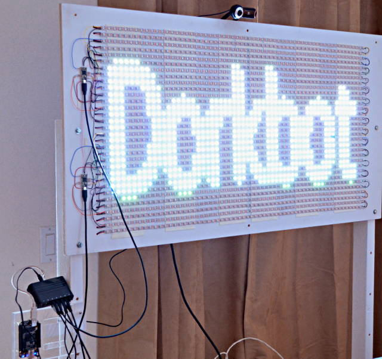

# LED Video and Animated GIF Demo at Maker Faire 2013

This C code ran on a Beaglebone Black.  It sent a composite of animated GIF images
and live webcam video to 1920 LEDs (60x32 matrix) using two Teensy 3.0 boards
running the OctoWS2811 VideoDisplay example (in Arduino, select Teensy and then
click **File > Examples > OctoWS2811 > VideoDisplay**)

Detailed info about the project can be found here:
https://www.dorkbotpdx.org/blog/paul/maker_faire_2013

